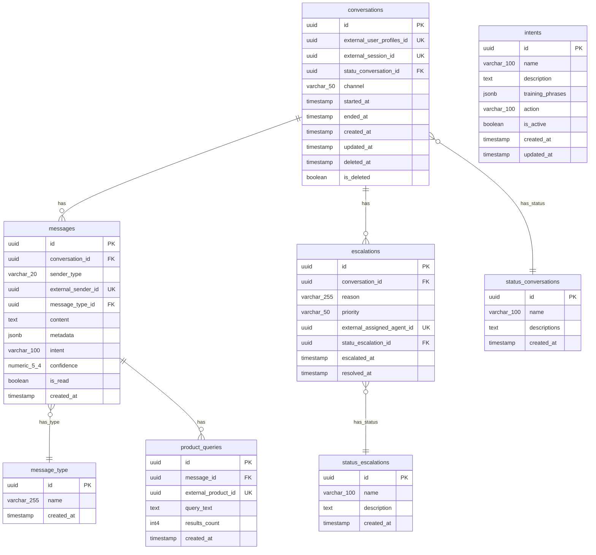
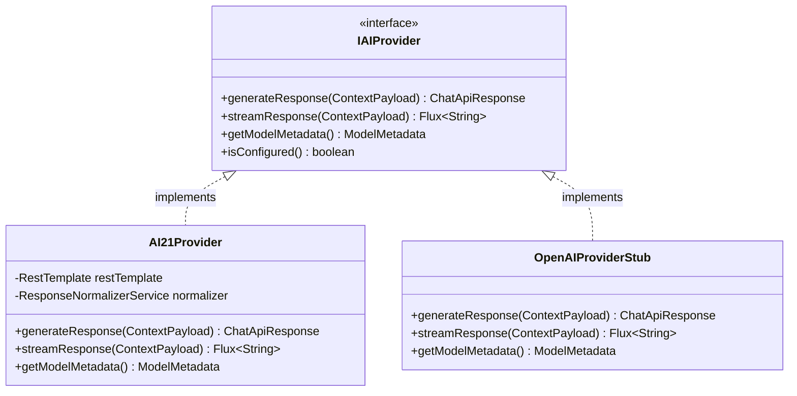

# Microservice Chatbot - Hexagonal + DDD + RAG Implementation Plan

Implementación completa de un microservicio RAG con arquitectura Hexagonal estricta y DDD para `microservice-chatbot`.

---

## Database Schema Reference

> [!IMPORTANT]
> **UUID Primary Keys**: Todas las entidades usan UUID como clave primaria para mayor seguridad.

### Chat Schema (Scope of this microservice)



### External Schemas (Reference Only - For RAG Context)

| Schema | Tables | Purpose |
|--------|--------|---------|
| **User** | user_profiles, user_preferences, address | Context for personalized responses |
| **Catalog** | products, variants, categories, images | Context for product-related queries |

---

## PromptTemplate (Default)

> [!IMPORTANT]
> Este es el PromptTemplate por defecto implementado en `application/services/PromptTemplate.java`:

```java
/**
 * Default PromptTemplate for Karibea RAG Chatbot
 * Location: com.microservice.chatbot.application.services.PromptTemplate
 */
public class PromptTemplate {

    // ========================= SYSTEM SECTION =========================
    private static final String SYSTEM_TEMPLATE = """
        You are Karibea Assistant, an intelligent and friendly virtual assistant for the Karibea e-commerce platform.
        
        YOUR ROLE:
        - Help customers find products, answer questions about orders, and provide excellent customer service
        - Be concise, helpful, and professional in all responses
        - Always prioritize accurate information from the provided context
        - If you don't have enough information, acknowledge it and offer to escalate to a human agent
        
        GUIDELINES:
        - Respond in the same language as the user's message
        - Never invent product information - only use data from the CONTEXT section
        - For order-related queries, always verify with context data
        - Be empathetic with customer concerns
        - Keep responses under 150 words unless detailed explanation is needed
        
        RESTRICTIONS:
        - Never share internal system details or technical information
        - Never process payments or modify orders directly
        - Never share personal data of other customers
        - Always recommend escalation for complex issues
        """;

    // ========================= CONTEXT SECTION =========================
    private static final String CONTEXT_TEMPLATE = """
        
        ### RELEVANT CONTEXT ###
        The following information is retrieved from Karibea's database and is relevant to this conversation:
        
        %s
        
        Use this context to provide accurate and helpful responses. If the context doesn't contain 
        the information needed, acknowledge this limitation.
        ### END CONTEXT ###
        """;

    // ========================= HISTORY SECTION =========================
    private static final String HISTORY_TEMPLATE = """
        
        ### CONVERSATION HISTORY ###
        Previous messages in this conversation:
        
        %s
        
        Continue the conversation naturally, maintaining context from previous exchanges.
        ### END HISTORY ###
        """;

    // ========================= USER MESSAGE SECTION =========================
    private static final String USER_TEMPLATE = """
        
        ### CURRENT USER MESSAGE ###
        User says: %s
        ### END USER MESSAGE ###
        """;

    // ========================= OUTPUT FORMAT SECTION =========================
    private static final String OUTPUT_FORMAT_TEMPLATE = """
        
        ### REQUIRED OUTPUT FORMAT ###
        You MUST respond with a valid JSON object in the following exact format:
        
        {
            "answer_text": "Your helpful response to the user in natural language",
            "sources": [
                {
                    "id": "source_id_from_context",
                    "type": "product|order|faq|policy",
                    "score": 0.95
                }
            ],
            "actions": [
                {
                    "type": "open_url|add_to_cart|escalate|none",
                    "payload": {
                        "url": "optional_url",
                        "product_id": "optional_product_id"
                    }
                }
            ],
            "intent": {
                "id": "detected_intent_name",
                "confidence": 0.87
            }
        }
        
        IMPORTANT:
        - answer_text: Required. Your natural language response to the user
        - sources: List sources from context used in your response. Empty array if none
        - actions: Suggested actions. Use type:"none" with empty payload if no action needed
        - intent: Detected user intent with confidence score (0.0 to 1.0)
        
        Common intents: product_search, order_status, price_inquiry, shipping_info, 
                       return_request, complaint, general_question, greeting, farewell
        ### END OUTPUT FORMAT ###
        """;
}
```

---

## Package Structure

```
com.microservice.chatbot/
├── MicroserviceChatbotApplication.java
├── application/
│   ├── dto/
│   ├── exception/
│   ├── mapper/
│   ├── services/
│   └── usecases/
├── domain/
│   ├── events/
│   ├── exceptions/
│   ├── models/
│   └── port/
│       ├── in/
│       └── out/
└── infrastructure/
    ├── adapters/
    │   ├── provider/
    │   └── retriever/
    ├── config/
    ├── controller/
    ├── entities/
    ├── exceptions/
    │   └── advice/
    ├── kafka/
    │   ├── config/
    │   ├── consumer/
    │   └── producer/
    └── repositories/
```

---

## Components Summary

### Domain Layer
| Type | Count | Files |
|------|-------|-------|
| Models | 9 | Conversation, Message, Escalation, Intent, ProductQuery, ContextPayload, ChatSource, ModelMetadata, ChatAction |
| Input Ports | 5 | SendMessageUseCase, GetConversationUseCase, CreateConversationUseCase, GetSourcesUseCase, EscalateUseCase |
| Output Ports | 6 | IAIProvider, RetrieverService, ConversationRepositoryPort, MessageRepositoryPort, EscalationRepositoryPort, IntentRepositoryPort |
| Exceptions | 5 | ChatDomainException, ConversationNotFoundException, InvalidMessageException, MessageLimitExceededException, AIProviderException |
| Events | 2 | MessageSentEvent, EscalationCreatedEvent |

### Application Layer
| Type | Count | Files |
|------|-------|-------|
| DTOs | 7 | MessageRequest, ConversationRequest, EscalationRequest, ChatApiResponse, ConversationResponse, SourceResponse, EscalationResponse |
| Services | 5 | PromptTemplate, ChatOrchestrationService, ContextBuilderService, SanitizationService, ResponseNormalizerService |
| Use Cases | 5 | SendMessageUseCaseImpl, GetConversationUseCaseImpl, CreateConversationUseCaseImpl, GetSourcesUseCaseImpl, EscalateUseCaseImpl |
| Mappers | 1 | ConversationMapper |

### Infrastructure Layer
| Type | Count | Files |
|------|-------|-------|
| JPA Entities | 8 | ConversationEntity, MessageEntity, EscalationEntity, IntentEntity, ProductQueryEntity, StatusConversationEntity, StatusEscalationEntity, MessageTypeEntity |
| Repositories | 7 | 4 JPA Repositories + 3 Adapters |
| Adapters | 3 | AI21Provider, OpenAIProviderStub, SqlRetrieverService |
| Controller | 1 | ChatController (5 endpoints) |
| Config | 3 | OpenApiConfig, BeanConfig, CorsConfig |
| Kafka | 5 | KafkaProducerConfig, KafkaConsumerConfig, KafkaTopicConfig, KafkaEventPublisher, KafkaEventConsumer |

---

## API Endpoints

| Method | Endpoint | Description |
|--------|----------|-------------|
| `POST` | `/api/chat/messages` | Send message and get AI response |
| `GET` | `/api/chat/conversations/{id}` | Get conversation with messages |
| `POST` | `/api/chat/conversations` | Create new conversation |
| `GET` | `/api/chat/sources` | Get available RAG sources |
| `POST` | `/api/chat/escalate` | Escalate to human agent |

---

## Provider-Agnostic Architecture



**Configuration** (`application.yml`):
```yaml
ai:
  provider: ai21  # or "openai_stub" for testing
  ai21:
    api-key: ${CHATBOT_AI21_API_KEY}
    api-url: https://api.ai21.com/studio/v1/chat/completions
    model: jamba-mini-1.7
```

---

## Verification

### Build Commands
```bash
cd c:\Users\anonimo\Pictures\karibea_backend\microservice-chatbot
mvn clean compile
mvn spring-boot:run -Dspring-boot.run.profiles=dev
```

### Test Endpoints
```bash
# Create conversation
curl -X POST http://localhost:8087/api/chat/conversations \
  -H "Content-Type: application/json" \
  -d '{"externalUserProfileId": "uuid-here", "channel": "web"}'

# Send message
curl -X POST http://localhost:8087/api/chat/messages \
  -H "Content-Type: application/json" \
  -d '{"conversationId": "uuid-here", "content": "Hello!"}'
```
